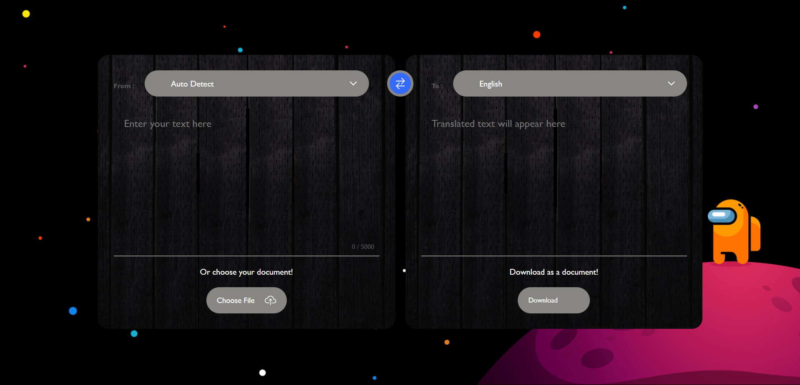
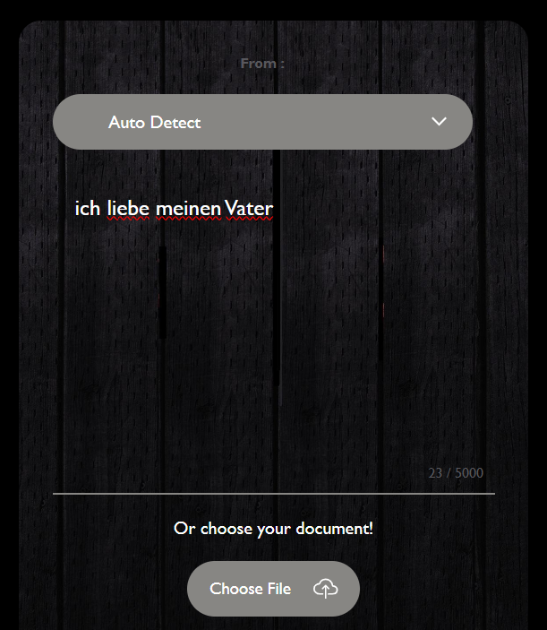
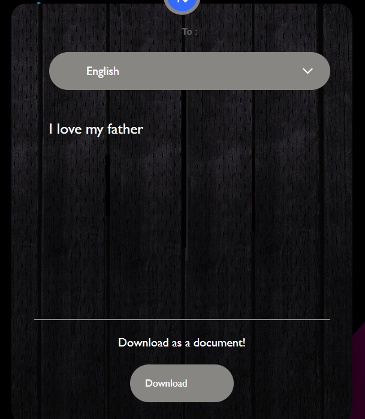

# 🎯 GlobaLingo - A Language Translator  



## 📌 About the Project
**GlobaLingo**  is a simple yet powerful language translation web app built using HTML, CSS, and JavaScript.
It allows users to translate text between multiple languages with ease and supports file upload for translation!
## 🚀 Features
- 🌎 Translate text between multiple languages
- 📂 Upload a file and translate its content
- 📥 Download translated text as a file 
- 📝 Clean and user-friendly interface 
- 🎨 Responsive design for all devices  

## 🛠️ Technologies Used
- **HTML** - Structure of the application  
- **CSS** - Styling and layout  
- **JavaScript** -  Handling API requests and translation logic

## 📷 Screenshots on Desktop


## 📷 Screenshots on Phone



## 📂 How to Use  
1. Type or paste the text in the input box.
2. It will automatically detect the language of the input.  
3. Select the target language you want to translate into from the dropdown.
4. The translation will appear instantly and in real-time  
5. You can also upload a file to translate its content directly.
6. Once translated, click on Download to save the translated text as a file.

## 🌐 Live Demo  
🔗 [Want to Try it !! Here you go ](https://vedless.github.io/GlobaLingo/)  

## 📥 Installation
Want to run it locally? Follow these steps:  
1. Clone the repository:  
   ```bash
   git clone https://github.com/VEDLESS/GlobaLingo.git  

